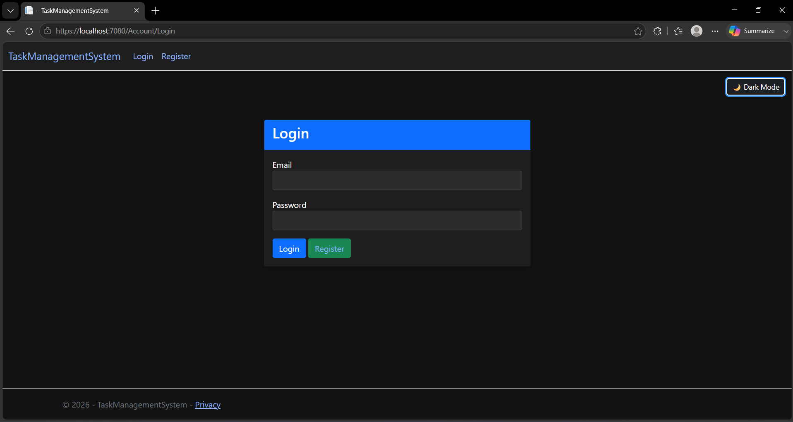
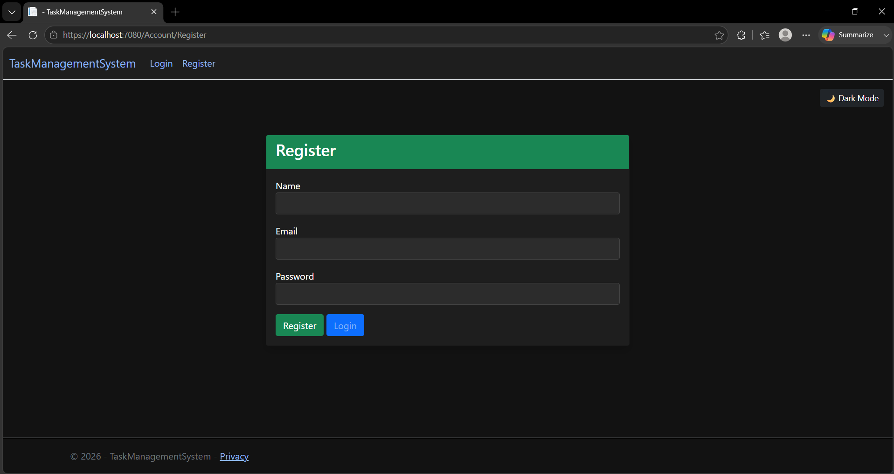
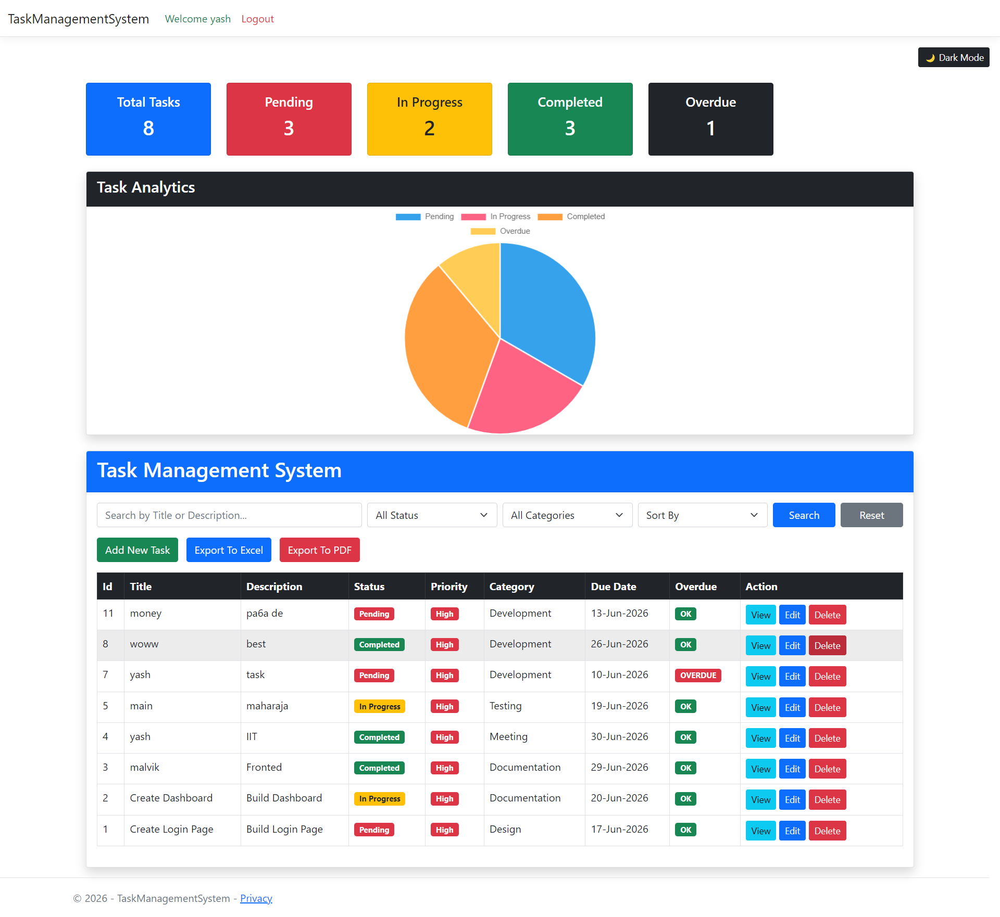
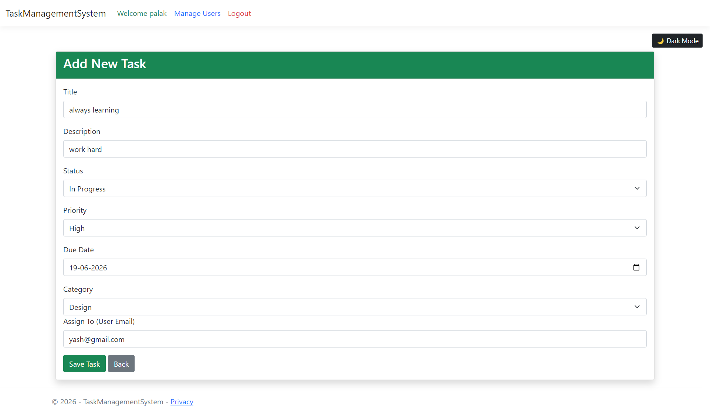

# Task Management System

A powerful **Task Management Web Application** built with **ASP.NET Core MVC** and **SQL Server** to efficiently manage tasks, users, and roles with secure authentication and role-based access control.


---

## ✨ Features

### 🔐 Authentication & Security

* User Registration & Login
* Session-Based Authentication
* Role-Based Authorization

### 👥 User Roles

* **User** – View and update assigned tasks
* **Admin** – Manage tasks and users
* **SuperAdmin** – Full system control

### 📋 Task Management

* Create Tasks
* Edit Tasks
* Delete Tasks
* Assign Tasks to Users
* Track Task Status
* Set Task Priority
* Manage Due Dates
* Categorize Tasks

### 🎨 UI Features

* Responsive Design
* Dark Mode Support
* Clean Bootstrap Interface

---

## 🛠️ Tech Stack

| Technology          | Usage                 |
| ------------------- | --------------------- |
| ASP.NET Core MVC    | Backend Framework     |
| C#                  | Programming Language  |
| SQL Server          | Database              |
| ADO.NET             | Database Connectivity |
| Bootstrap 5         | UI Design             |
| HTML/CSS/JavaScript | Frontend              |

---

## 🗄️ Database Schema

### Users Table

* Id
* Name
* Email
* Password
* Role

### Tasks Table

* Id
* Title
* Description
* Status
* Priority
* Category
* DueDate
* UserEmail

---

## 👨‍💻 Role Permissions

| Feature             | User | Admin | SuperAdmin |
| ------------------- | ---- | ----- | ---------- |
| View Assigned Tasks | ✅    | ✅     | ✅          |
| Create Tasks        | ✅    | ✅     | ✅          |
| Edit Tasks          | ✅    | ✅     | ✅          |
| Delete Tasks        | ❌    | ✅     | ✅          |
| Manage Users        | ❌    | ✅     | ✅          |
| Change Roles        | ❌    | ❌     | ✅          |

---
## 📸 Screenshots

### 🔑 Login Page



---

### 📝 Register Page



---

### 👤 User Dashboard



---

### 👑 Admin Dashboard


---

### 📌 Task Assignment



---


## ⚙️ Installation Guide

### 1️⃣ Clone Repository

```bash
git clone https://github.com/palakkojani/TaskManagementSystem.git
```

### 2️⃣ Open in Visual Studio

Open the solution file in **Visual Studio 2022**.

### 3️⃣ Configure Database

Update the SQL Server connection string in:

```json
appsettings.json
```

### 4️⃣ Create Database Tables

Run SQL scripts to create:

* Users
* Tasks

### 5️⃣ Run Application

Press:

```text
F5
```

or click **Start Debugging**.

---

## 🔮 Future Enhancements

* 📧 Email Notifications
* 📎 File Attachments
* 📊 Dashboard Analytics
* 🌐 REST API
* 🔔 Real-Time Notifications
* 📱 Mobile Responsive UI

---

## 👨‍💻 Author

**Palak Kojani**

🎓 Cybersecurity Student
💻 ASP.NET Developer
🔐 Bug Hunter

GitHub: https://github.com/palakkojani

---

⭐ If you like this project, don't forget to **Star** the repository!
